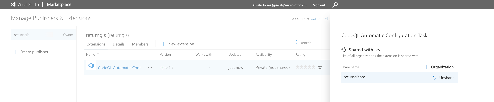

# CodeQL Auto-Setup task

This extension helps us to obtain the programing languages that the repository uses and set up `AdvancedSecurity.CodeQL.Language` for the next task, called AdvancedSecurity-CodeQL-Init.

## How to use it

The first thing you need to do is to install the dependencies that the task needs. You can do this by running the following command:

```bash
cd src/extensions/codeql-autosetup/buildandreleasetask
npm install
```

Then you have to compile the task, to get the `.js` file:

```bash
tsc
```

Once you have it you need to change the name of the publisher in the `vss-extension.json` file:

```javascript
{
    "manifestVersion": 1,
    "id": "advancedsecurity-codeql-autoconfig-task",
    "name": "CodeQL Automatic Configuration Task",
    "version": "0.1.5",
    "publisher": "PUT_YOUR_PUBLISHER_NAME_HERE",
    "targets": [
        {
            "id": "Microsoft.VisualStudio.Services"
        }
    ]   
}
```

And finally, you need to package the extension. You can do this by running the following command:

```bash
cd ..
npx tfx-cli extension create
```

It will create a `.vsix` file in the root of the project. You can upload this file to the [Azure DevOps Marketplace](https://marketplace.visualstudio.com/manage).

> Note: Don't forget to share the extension with the organization that you want to use it.



## Install the task in your organization

You can install the task in your organization by going to the `Organization settings` -> `Extensions` -> `Shared` and search for the task.

Now you are ready to use the task in your pipelines 🎉.

## Permissions

You have to make sure that your pipelines have the necessary permissions to run the task. You can do this by going to the `Project settings` -> `Permissions` -> `Contributors` -> `Members` and add `PROJECT_NAME Build Service (ORGANIZATION_NAME)`.