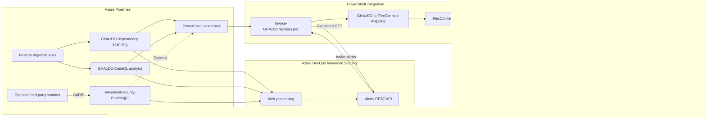

# GHAzDO to Nucleus FlexConnect

This integration exports GitHub Advanced Security for Azure DevOps (GHAzDO)
alerts to a Nucleus project. It provides a file-based approximation of the
native Nucleus GitHub Advanced Security connector.

## Architecture



The scanner tasks publish results to GHAzDO first. The exporter does not parse
CodeQL output, dependency manifests, or SARIF directly. It reads normalized
alerts from the GHAzDO Alerts API, waits for a stable active snapshot, maps that
snapshot to a Nucleus FlexConnect scan, and uploads the scan as one bulk
ingestion payload.

The integration supports active:

- Code alerts from CodeQL and normalized third-party SARIF publishers
- Dependency/SCA alerts
- Secret-scanning alerts at both `High` and `Other` confidence

This is not a native or bidirectional connector. It does not synchronize
GHAzDO dismissal reasons or manual statuses back to Nucleus.

## Files

| File | Purpose |
| --- | --- |
| `Invoke-GHAzDONucleus.ps1` | Retrieves, converts, writes, and uploads one repository snapshot |
| `GHAzDONucleus.psm1` | API, pagination, mapping, serialization, and upload functions |
| `ghazdo-nucleus-template.yml` | Basic .NET/NuGet pipeline steps template |
| `Test-GHAzDODefaultBranch.ps1` | Optional default-branch filter helper |
| `tests/Test-GHAzDONucleus.ps1` | Fixture-driven validation without external test modules |

## Prerequisites

1. Enable GHAzDO for the Azure Repos Git repository.
2. Create a Nucleus project and API key.
3. Grant the pipeline identity permission to read the repository and Advanced
   Security alerts. For local PAT use, grant:
   - Advanced Security: Read
   - Code: Read
4. Store these Azure Pipelines variables:

| Variable | Secret | Example |
| --- | ---: | --- |
| `nucleus-base-url` | No | `https://example.nucleussec.com/nucleus` |
| `nucleus-project-id` | No | Nucleus project ID |
| `nucleus-api-key` | Yes | Nucleus user API key |

The template maps `$(System.AccessToken)` into the PowerShell task and uses
Bearer authentication. If the job OAuth token cannot be granted the required
permissions, map a PAT into `MAPPED_ADO_PAT`; the script uses Basic
authentication for that fallback.

Do not place either token on the command line or in source control.

## Basic .NET pipeline

Copy the `src/nucleus` directory into the repository being scanned, then
reference the template:

```yaml
trigger:
  branches:
    include:
      - main

pool:
  vmImage: ubuntu-latest

steps:
  - template: src/nucleus/ghazdo-nucleus-template.yml
```

The template deliberately uses a basic flow:

1. Initialize CodeQL with `buildtype: None`.
2. Authenticate NuGet feeds and explicitly restore .NET dependencies.
3. Run `AdvancedSecurity-Dependency-Scanning@1`.
4. Run `AdvancedSecurity-Codeql-Analyze@1` with
   `WaitForProcessing: true`.
5. Wait for a stable Alerts API snapshot and upload it to Nucleus.

An explicit restore is important because dependency scanning can complete
without detecting components when packages have not been restored.
`buildtype: None` and this restore sequence are a simple .NET example, not
universal build guidance. Adapt initialization and build steps for other
languages and repository layouts.

### Processing behavior

`AdvancedSecurity-Codeql-Analyze@1` has a documented processing wait.
`AdvancedSecurity-Dependency-Scanning@1` does not. The template runs dependency
scanning first so its results can process while CodeQL runs. The exporter then
polls complete active snapshots until two consecutive snapshots match.

This is bounded, best-effort dependency readiness. The public Alerts API cannot
prove that a dependency scan with zero findings has completed processing.
Increase the wait timeout, interval, or stable-iteration values in the template
for slower environments.

## Optional default-branch filtering

Nucleus treats the branch as part of an Application asset's identity. Running
only on the default branch generally produces the most stable asset inventory,
but branch filtering is not required by the integration.

The optional helper queries the repository's real `defaultBranch` and sets
`RunNucleusIngestion`:

```yaml
steps:
  - task: PowerShell@2
    displayName: Check repository default branch
    inputs:
      targetType: filePath
      filePath: src/nucleus/Test-GHAzDODefaultBranch.ps1
      pwsh: true
    env:
      SYSTEM_ACCESSTOKEN: $(System.AccessToken)

  - template: src/nucleus/ghazdo-nucleus-template.yml
```

The template runs unless `RunNucleusIngestion` is explicitly set to `false`.
Without this helper, it exports the current `Build.SourceBranch` as a separate
Nucleus Application branch asset.

## Dry run and local use

Generate and inspect FlexConnect JSON without uploading:

```powershell
$env:MAPPED_ADO_PAT = '<Azure DevOps PAT>'

pwsh ./src/nucleus/Invoke-GHAzDONucleus.ps1 `
  -OrganizationUri 'https://dev.azure.com/contoso' `
  -Project 'security' `
  -Repository 'payments' `
  -Ref 'refs/heads/main' `
  -AdoAuthenticationType Basic `
  -DryRun
```

The default pipeline output is
`$(Build.ArtifactStagingDirectory)/ghazdo-nucleus-<repository>.json`.
`-PublishArtifact` uploads that JSON as the `NucleusFlexConnect` pipeline
artifact for troubleshooting. The file contains vulnerability metadata and
should be retained according to the organization's security-data policy.

## FlexConnect mapping

### Scan and asset

| FlexConnect field | GHAzDO value |
| --- | --- |
| `nucleus_import_version` | `1` |
| `scan_tool` | Stable value `GHAZDO` |
| `scan_type` | `Application` |
| `scan_date` | UTC snapshot completion time |
| `host_name` | Stable Azure DevOps repository ID |
| `app_name_secondary` | `organization/project/repository` |
| `app_branch` | Pipeline Git ref |
| `app_repo_url` | Azure DevOps repository web URL |
| `asset_info` | Organization, project, repository ID, and repository name |

### Findings

| FlexConnect field | GHAzDO value |
| --- | --- |
| `finding_number` | Alert type + tool + stable rule/advisory ID |
| `finding_name` | Alert title, constrained to 128 ASCII characters |
| `finding_severity` | GHAzDO/SARIF severity normalized to a Nucleus severity |
| `finding_description` | Rule description |
| `finding_recommendation` | Rule help message |
| `finding_cve` | CVE and CWE identifiers found in rule metadata |
| `finding_discovered` | `firstSeenDate` |
| `finding_path` | First physical location path |
| `finding_line_number` | First physical location start line |
| `finding_package` | Conservatively parsed vulnerable component |
| `finding_package_version` | Component version when explicitly represented |
| `finding_references` | Alert ID/type/state, tool, rule, category, ref, commit, URL, and non-secret metadata |

`finding_number` identifies the Nucleus unique finding. The organization-wide
GHAzDO `alertId` remains instance metadata so repeated instances of the same
rule group together instead of creating one unique finding per alert.

Package formats vary by ecosystem. The exporter only populates package/version
fields when the normalized logical location can be parsed without guessing;
the raw root dependency remains in references.

Fields that Nucleus scopes to the unique finding are normalized across every
instance sharing a `finding_number`: the highest severity and most complete
subtype win, CVE/CWE values are combined, and the lowest alert ID supplies
stable name/description/recommendation text.

## Snapshot and status semantics

Every upload is a complete snapshot of active findings for the selected
repository/ref. Because GHAzDO secret alerts are repository-level rather than
branch-scoped, they are included with the default-branch asset and omitted from
non-default branch assets to avoid duplication. The exporter intentionally does
not use `modifiedSince`; a delta file could cause Nucleus to resolve alerts that
were merely omitted.

Nucleus can mark an instance resolved via scan when it disappears from a later
snapshot. FlexConnect does not communicate why it disappeared. A GHAzDO alert
that is fixed, dismissed, auto-dismissed, accepted risk, or false positive is
therefore absent from the active snapshot, but its GHAzDO reason is not mapped
to a corresponding Nucleus manual status. Native connector parity would require
a supported status API workflow or a first-party Nucleus connector.

## Third-party SARIF

The exporter is tool-agnostic for normalized GHAzDO `code` alerts. A compatible
third-party workflow can:

1. Run the scanner and produce SARIF.
2. Publish it to GHAzDO using `AdvancedSecurity-Publish@1`.
3. Set `WaitForProcessing: true` on the publish task.
4. Run `Invoke-GHAzDONucleus.ps1` after the publish task.

Example publish step, intentionally not included in the basic template:

```yaml
- task: AdvancedSecurity-Publish@1
  displayName: Publish third-party SARIF
  inputs:
    SarifsInputDirectory: $(Build.SourcesDirectory)/sarif
    EnableRecursiveScanning: true
    Category: third-party
    WaitForProcessing: true
    WaitForProcessingInterval: 5
    WaitForProcessingTimeout: 300
```

Microsoft currently documents `AdvancedSecurity-Publish@1` for SARIF produced
by non-Microsoft tasks, including the Infrastructure-as-Code Scanning Tasks
extension. Confirm compatibility with the specific scanner before relying on
this path. The publish task is not needed for CodeQL analysis or dependency
scanning tasks.

## Secret safety

- The API request never asks for `ValidationFingerprint`.
- Both `High` and `Other` confidence levels are requested explicitly.
- `truncatedSecret`, validation fingerprints, and secret values are not copied
  into FlexConnect output or logs.
- Secret validity and confidence can be included as non-secret references.
- API keys and Azure DevOps tokens are only supplied through environment
  variables or secure parameters.

## Validation

Run the fixture-driven checks:

```powershell
pwsh -NoProfile -File ./src/nucleus/tests/Test-GHAzDONucleus.ps1
```

Run static analysis:

```powershell
Invoke-ScriptAnalyzer -Path ./src/nucleus -Recurse
```

## References

- [GHAzDO Alerts - List REST API](https://learn.microsoft.com/rest/api/azure/devops/advancedsecurity/alerts/list)
- [CodeQL Analyze task](https://learn.microsoft.com/azure/devops/pipelines/tasks/reference/advanced-security-codeql-analyze-v1)
- [Dependency Scanning task](https://learn.microsoft.com/azure/devops/pipelines/tasks/reference/advanced-security-dependency-scanning-v1)
- [Advanced Security Publish task](https://learn.microsoft.com/azure/devops/pipelines/tasks/reference/advanced-security-publish-v1)
- [Nucleus FlexConnect file schema](https://help.nucleussec.com/docs/flexconnect-framework)
- [Nucleus Application assets](https://help.nucleussec.com/docs/applications)
- [Nucleus vulnerability findings](https://help.nucleussec.com/docs/findings-1)
- [Nucleus scan upload example](https://help.nucleussec.com/docs/posting-a-custom-scan-file-to-nucleus-via-api-using-python3-requests-library-1)
